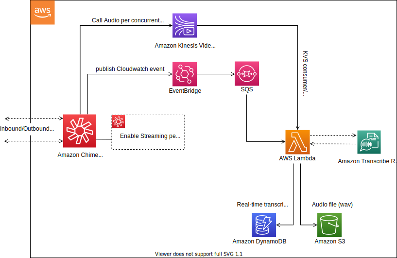
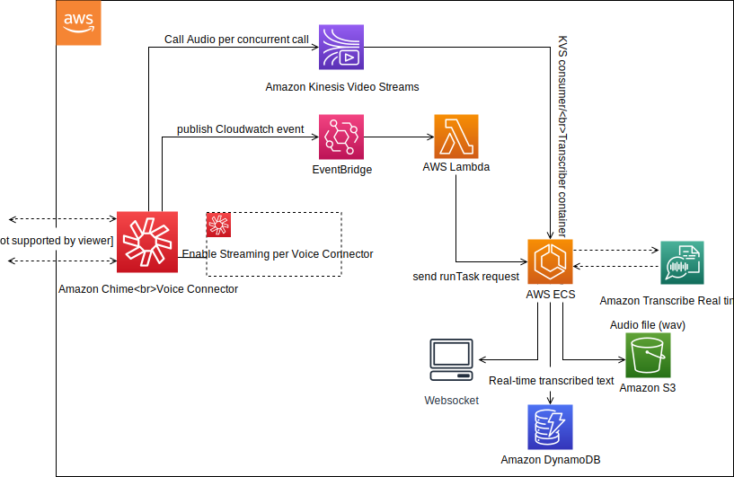

# Real-Time Transcription with Amazon Chime Voice Connector 


[](https://github.com/aws-samples/amazon-chime-voiceconnector-transcription/stargazers)


[](https://github.com/aws-samples/amazon-chime-voiceconnector-transcription/releases/latest)
[](https://github.com/aws-samples/amazon-chime-voiceconnector-transcription/commits/master)

Making it easy to get started with Amazon Chime Voice Connector live audio streaming and real-time transcription using Amazon Transcribe.

## On this Page
- [Project Overview](#project-overview)
- [Architecture Overview](#architecture-overview)
- [Getting Started](#getting-started)
- [Lambda Environment Variables](#lambda-environment-variables)
- [Lambda Invocation Event Details](#lambda-invocation-event-details)
- [Sample Trigger Lambda](#Sample-trigger-Lambda-function)

## Project Overview
The purpose of this project is to provide a code example and a fully functional AWS Lambda function to get you started with capturing and transcribing Amazon Chime Voice Connector phone calls using Amazon Kinesis Video Streams and Amazon Transcribe. This Lambda function can be used to create varying solutions such as capturing audio on calls for real time actions on transcriptions, or creating a call recording solution. To enable these different use-cases there are multiple [environment variables](#lambda-environment-variables) required for the lambda function.

## Lambda based
Lambda solution is easy to begin with and have a low infrastructure footprint. Note: Due to Lambda limit it can only transcribe around15 minutes of call audio.

### Architecture Overview


#### Description
This solution can be configured using the following services: [Amazon Chime](https://aws.amazon.com/chime/) - Voice Connector, [Amazon Kinesis Video Streams](https://aws.amazon.com/kinesis/video-streams), [Amazon CloudWatch](https://aws.amazon.com/cloudwatch/), [Amazon Simple Queue Service](https://aws.amazon.com/sqs/), [Amazon Transcribe](https://aws.amazon.com/transcribe), [Amazon DynamoDB](https://aws.amazon.com/dynamodb), [AWS Lambda](https://aws.amazon.com/lambda), and [Amazon S3](https://aws.amazon.com/s3).

With [Amazon Chime](https://aws.amazon.com/chime/) Voice Connector, customer audio can be live streamed to Kinesis Video Streams as described in this [Amazon Chime documentation](https://docs.aws.amazon.com/chime). This project serves as an example of how to consume an Amazon Chime Voice Connector live audio stream, capture the audio and send it to S3 in the form of an audio wav file, as well as perform real-time transcription using [Amazon Transcribe](https://aws.amazon.com/transcribe) and posting those transcriptions to a DynamoDB table. 

In the diagram above:

- (Step 1) Configure Voice Connector to stream the real-time audio of Voice Connector SIP trunk calls or SIP-based Media Recording (SIPREC) media streams from your on-premises Session Border Controller (SBC), Private Branch Exchange (PBX), or Contact Center
- (Step 2) In the Amazon Chime Voice Connector configuration page in the AWS Chime Console
    - Ensure "start" is selected in the Streaming tab next to "Send to Kinesis Video Streams"
    - Amazon Chime Voice connector will create a stream for each concurrent call party (2 streams per call) while this option is selected and publish CloudWatch events with the TransactionId, Kinesis Video Stream ARN, and Fragment Number when a call starts.
- (Step 3) A CloudWatch event rule is created to take these events and send them to a target SQS Queue
- (Step 4) A Lambda function is created using the sample code in this repository to trigger off of this SQS Queue. This Lambda will serve as a Kinesis Video Stream (KVS) Consumer/transcriber and will continue to process audio for a maximum of 15 minutes (Lambda limit) or until the call is disconnected.
- (Step 5) The Lambda function will take the transcripts returned from Amazon Transcribe and save the transcripted segments to a DynamoDB table.  It will also save the audio bytes to a file when the call ends and upload to S3 as a wav file.


The Lambda code expects the Kinesis Video Stream details provided by the Amazon CloudWatch Event including `transactionId`, `streamArn` and `startFragmentNumber`.The handler function of the Lambda is present in `KVSTranscribeStreamingLambda.java` and it uses the GetMedia API of Kinesis Video Stream to fetch the InputStream of the customer audio call. The InputStream is processed using the AWS Kinesis Video Streams provided Parser Library. If the `transcriptionEnabled` property is set to true on the input, a TranscribeStreamingRetryClient client is used to send audio bytes of the audio call to Transcribe. As the transcript segments are being returned, they are saved in a DynamoDB table having TransactionId as the Partition key and StartTime of the segment as the Sort key. The audio bytes are also saved in a file along with this and at the end of the audio call, if the `saveCallRecording` property is set to true on the input, the WAV audio file is uploaded to S3 in the provided `RECORDINGS_BUCKET_NAME` bucket. 

As of this writing Amazon Transcribe supports real time transcription of British English (en-GB), US English (en-US), French (fr-FR), Canadian French (fr-CA); and US Spanish (es-US). See the Amazon Transcribe [streaming documentation](https://docs.aws.amazon.com/transcribe/latest/dg/streaming.html) for the latest supported languages.

## Container based


With container based solution you can transcribe the calls longer then 15 min.

### Architecture Overview


#### Description
This solution can be configured using the following services: [Amazon Chime](https://aws.amazon.com/chime/) - Voice Connector, [Amazon Kinesis Video Streams](https://aws.amazon.com/kinesis/video-streams), [Amazon EventBridge](https://aws.amazon.com/eventbridge), [Amazon Transcribe](https://aws.amazon.com/transcribe), [Amazon DynamoDB](https://aws.amazon.com/dynamodb), [AWS Lambda](https://aws.amazon.com/lambda), [Amazon Elastic Container Service](https://aws.amazon.com/ecs/) and [Amazon S3](https://aws.amazon.com/s3).

With [Amazon Chime](https://aws.amazon.com/chime/) Voice Connector, customer audio can be live streamed to Kinesis Video Streams as described in this [Amazon Chime documentation](https://docs.aws.amazon.com/chime). This project serves as an example of how to consume an Amazon Chime Voice Connector live audio stream, capture the audio and send it to S3 in the form of an audio wav file, as well as perform real-time transcription using [Amazon Transcribe](https://aws.amazon.com/transcribe) and posting those transcriptions to a DynamoDB table. 

In the diagram above:

- (Step 1) Configure Voice Connector to stream the real-time audio of Voice Connector SIP trunk calls or SIP-based Media Recording (SIPREC) media streams from your on-premises Session Border Controller (SBC), Private Branch Exchange (PBX), or Contact Center
- (Step 2) In the Amazon Chime Voice Connector configuration page in the AWS Chime Console
    - Ensure "start" is selected in the Streaming tab next to "Send to Kinesis Video Streams"
    - Amazon Chime Voice connector will create a stream for each concurrent call party (2 streams per call) while this option is selected and publish CloudWatch events with the TransactionId, Kinesis Video Stream ARN, and Fragment Number when a call starts.
- (Step 3) A EventBridge event rule is created to take these events and trigger a Lambda function
- (Step 4) A container application is created using the sample code in this repository to trigger off of this Lambda function. This container application will serve as a Kinesis Video Stream (KVS) Consumer/transcriber and will continue to process audio for until the call is disconnected.
- (Step 5) The container application will take the transcripts returned from Amazon Transcribe and save the transcripted segments to a DynamoDB table.  It will also save the audio bytes to a file when the call ends and upload to S3 as a wav file.

The container service code expects the Kinesis Video Stream details provided by the Amazon EventBridge Event including `transactionId`, `streamArn` and `startFragmentNumber`.The handler function of the container service is present in `KVSTranscribeStreamingHandler.java` and it uses the GetMedia API of Kinesis Video Stream to fetch the InputStream of the customer audio call. The InputStream is processed using the AWS Kinesis Video Streams provided Parser Library. If the `transcriptionEnabled` property is set to true on the input, a TranscribeStreamingRetryClient client is used to send audio bytes of the audio call to Transcribe. As the transcript segments are being returned, they are saved in a DynamoDB table having TransactionId as the Partition key and StartTime of the segment as the Sort key. The audio bytes are also saved in a file along with this and at the end of the audio call, if the `saveCallRecording` property is set to true on the input, the WAV audio file is uploaded to S3 in the provided `RECORDINGS_BUCKET_NAME` bucket. 

As of this writing Amazon Transcribe supports real time transcription of British English (en-GB), US English (en-US), French (fr-FR), Canadian French (fr-CA); and US Spanish (es-US). See the Amazon Transcribe [streaming documentation](https://docs.aws.amazon.com/transcribe/latest/dg/streaming.html) for the latest supported languages.

## Getting Started
The simplest way to get started with this project is to use the Amazon CloudFormation template instructions below to deploy resources required.  With both options you must ensure that you have an active Amazon Chime Voice Connector with the "Streaming" feature enabled by following the [Amazon Chime Voice Connector documentation](https://docs.aws.amazon.com/chime/latest/ag/start-kinesis-vc.html) for "Enable Streaming".

Once your deployment is complete, you can test by making calls through your Amazon Chime Voice Connector and verifying the transcribed segments are populated in the Amazon DynamoDB table and the Amazon S3 bucket contains the recordings.  

## Amazon CloudFormation deployment instructions

### Downloading Project Artifacts

Create a directory to download the project artifacts
```bat
mkdir audiodemo
cd audiodemo
```

Download the sample and CloudFormation template

**Windows**

Using powershell **invoke-webrequest** download the sample and CloudFormation template

```powershell
Invoke-WebRequest https://github.com/aws-samples/amazon-chime-voiceconnector-transcription/releases/download/v0.16.0/deployment-template.json -OutFile deployment-template.json
```
```powershell
Invoke-WebRequest https://github.com/aws-samples/amazon-chime-voiceconnector-transcription/releases/download/v0.16.0/amazon-chime-voiceconnector-recordandtranscribe.zip -OutFile amazon-chime-voiceconnector-recordandtranscribe.zip
```

**macOS**

Using **wget** download the sample and CloudFormation template

```
wget https://github.com/aws-samples/amazon-chime-voiceconnector-transcription/releases/download/v0.16.0/deployment-template.json
```
```
wget https://github.com/aws-samples/amazon-chime-voiceconnector-transcription/releases/download/v0.16.0/amazon-chime-voiceconnector-recordandtranscribe.zip
```
> Missing Wget? Install using [brew](https://brew.sh/)
>```
>brew install wget
>```
>> Missing brew?
>>```ruby
>>/usr/bin/ruby -e "$(curl -fsSL https://raw.githubusercontent.com/Homebrew/install/master/install)"
>>```

### (Optional) Configure AWS IAM User

If administrative credential is not available, AWS account admin can use the following command to create a user for sample deployment, or grant the permission using the attached [policy file](permission/policy.json).

Create IAM user with empty policy.
```
aws iam create-user --user-name chime-transcription-deployment-engineer
```

Create deployment policy.
```
aws iam create-policy --policy-name chime-transcription-deployment-policy --policy-document file://permission/policy.json
```

Attach the policy to the user.
```
aws iam attach-user-policy --user-name chime-transcription-deployment-engineer --policy-arn arn:aws:iam::<accountid>:policy/chime-transcription-deployment-policy
```

Create access key for the user. 
> :warning: **Manage IAM user access keys properly and rotate the key frequently**
```
aws iam create-access-key --user-name chime-transcription-deployment-engineer
```

### Deploying Sample

Use [AWS Command Line Interface](https://aws.amazon.com/cli/) to deploy the sample

Configure AWS Command Line Interface. You can use access key from last step to configure AWS CLI.
```
aws configure
```

Create S3 bucket to upload the lambda code
```
aws s3api create-bucket --bucket source-us-east-1-<accountid> --region us-east-1
```

Package local artifacts
```
aws cloudformation package --template-file deployment-template.json --s3-bucket source-us-east-1-<accountid> --force-upload --use-json --output-template-file packaged.json
```

Deploy the package
> :warning: **choose `SolutionType=LAMBDA` for Lambda based solution `SolutionType=ECS` for Container based solution**

```
aws cloudformation deploy --template-file packaged.json --stack-name CallAudioDemo --capabilities CAPABILITY_IAM --region us-east-1 --parameter-overrides SolutionType=<LAMBDA|ECS>
```

Place test calls through Amazon Voice Connector and view transcripts in DynamoDB and recordings in S3.
